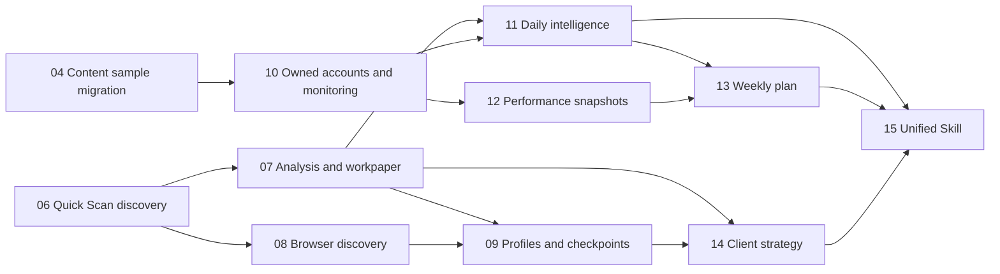

# MediaHunter Remaining Implementation Roadmap

## Current Baseline

Last completed feature commit before this roadmap: `e9d3168 feat: add research project brief intake`.

Completed work:

- Task 01: injectable application assembly, external adapter boundaries, and Testcontainers integration fixtures.
- Task 02: shared content fact model.
- Task 03: collection and article workflows migrated to shared content.
- Task 05: Research Project, versioned Project Brief intake, confirmation gate, workspace, and initial `mediahunter` Skill entry.

Remaining work is Task 04 and Tasks 06-15. OpenAI credentials remain intentionally unconfigured until Task 07.

## Delivery Order

Recommended implementation sequence:

1. Task 04 and Task 06.
2. Task 07, Task 08, and Task 10.
3. Task 09, Task 11, and Task 12.
4. Task 13 and Task 14.
5. Task 15 and final acceptance.

Task 04 and Task 06 may be developed independently. After they finish, Task 07, Task 08, and Task 10 can also proceed independently if separate worktrees are used.

## Engineering Rules

- MediaHunter remains the only durable source of truth. Skills call APIs and do not create parallel article stores.
- Shared article facts live in `content_source`, `content_article`, immutable `content_snapshot`, and image references.
- Project and Owned Account tables store relationships, relevance, decisions, analysis, and performance, not copied article bodies.
- Public discovery is the default. Browser discovery is a separate, restricted adapter and never persists credentials.
- Formal outputs are versioned. Daily intelligence may publish automatically; weekly and client outputs require approval.
- Every task adds deterministic unit and PostgreSQL integration tests. No test may call a real model, public website, or authenticated browser.
- Complete each task with `pnpm verify`, a focused code review, a clean worktree, and one scoped commit.

## Task 04: Contract Duplicate Content Samples

Goal: migrate incubation content samples from duplicated article facts to references to shared content.

Implementation:

- Add nullable shared article and snapshot references to incubation content samples.
- Build an idempotent expand/migrate/contract migration service with run records and unmatched review state.
- Match legacy samples by canonical URL first, then normalized URL/title/source evidence with explicit confidence.
- Preserve benchmark account, track, topic, comment-demand, operational labels, and analysis fields.
- Change new sample creation to select or submit a shared article and store only relationship metadata.
- Keep compatibility reads during migration; remove duplicated body/source writes only after readiness checks pass.
- Add backup/readiness endpoints and an unmatched-sample review UI.

Tests and completion:

- Repeated migration produces no duplicate links.
- Ambiguous and unmatched samples remain reviewable.
- Existing incubation views, exports, topics, and comments keep working.
- Expand, migrate, and contract phases each pass independently.

Commit target: `feat: reference shared content from incubation samples`.

## Task 06: Quick Scan Public Discovery

Goal: turn a confirmed Project Brief into traceable search directions and a selectable Project Evidence set.

Implementation:

- Add `PublicDiscoveryAdapter` with deterministic test and public-web default implementations.
- Generate company, account, and keyword search directions from the confirmed Brief version, each with rationale.
- Add discovery runs with query, source URL, timestamp, confidence, counts, errors, status, and recovery action.
- Add project-to-source and project-to-article evidence relations with candidate/included/excluded status and decision reason.
- Store discovered accounts in shared `content_source`; fetch successful articles into shared content once.
- Implement Quick Scan targets of 3-5 accounts and 15-30 articles without treating quotas as evidence quality.
- Add manual account/article supplementation and include/exclude actions.
- Add workspace sections for discovery status, search directions, evidence filtering, and retry actions.

Tests and completion:

- Unconfirmed projects cannot scan.
- Deterministic discovery completes a 3-account/15-article loop with no internet access.
- Empty, failed, and partially inaccessible results produce explicit recoverable states.
- Project Evidence references shared records and does not duplicate article text.

Commit target: `feat: add quick scan project discovery`.

## Task 07: Content Analysis And Research Workpaper

Goal: analyze included Project Evidence into versioned analysis cards and an internal workpaper.

Implementation:

- Resume the OpenAI key workflow and save the key only after the local path is explicitly confirmed.
- Extend `AnalysisWorkflowAdapter` for batch article analysis with deterministic fixtures.
- Add versioned Content Analysis Cards covering audience, objective, theme, narrative, structure, format, brand expression, transferability, and risk.
- Add Project Analysis Extensions tied to a Project Brief version and explicit project questions.
- Store evidence references at article, snapshot, analysis-version, and evidence-type level.
- Generate a versioned Research Workpaper containing included/excluded evidence, account patterns, factual observations, inferences, uncertainty, and recommendations.
- Display `AI not configured` and model failures explicitly. Keep rule output and model output separately typed and labeled.
- Add batch progress, retry-failed-only, and cost/token metadata without exposing secrets.

Tests and completion:

- End-to-end tests use deterministic AI only.
- Re-analysis creates a new version without replacing prior conclusions.
- Every major workpaper claim resolves to evidence and analysis versions.
- A controlled real-model smoke test is run separately only after key configuration.

Commit target: `feat: add project analysis cards and workpapers`.

## Task 08: Restricted Browser Discovery And Intervention Queue

Goal: supplement insufficient public results through the user's existing browser session without taking ownership of credentials.

Implementation:

- Implement the existing `BrowserDiscoveryAdapter` contract through a local collection agent.
- Add explicit start, pause, stop, resume, and observable progress controls.
- Normalize and deduplicate discovered links before shared-content ingestion.
- Add Intervention Queue records for verification challenges, permission boundaries, inaccessible pages, and ambiguous candidates.
- Add user decisions: continue, skip, amend target, or terminate, all with audit records.
- Redact cookies, authorization headers, browser profile paths, and page secrets from logs and exports.
- Ensure browser work cannot run remotely or unattended in phase one.

Tests and completion:

- Adapter substitutes cover success, pause, challenge, ambiguity, resume, and stop.
- Database and logs contain no browser credentials.
- One controlled local-browser acceptance run discovers public links and handles a boundary without bypassing it.

Commit target: `feat: add restricted browser discovery queue`.

## Task 09: Research Profiles, Checkpoints, And Saturation

Goal: support Quick Scan, Standard Study, and Deep Study with risk-based continuation rules.

Implementation:

- Define profile defaults and project overrides for account/article ranges, analysis depth, and checkpoint cadence.
- Add a research state machine for collecting, analyzing, checkpoint-waiting, saturated, completed, and stopped states.
- Require Deep Study confirmation before broad collection.
- Trigger Standard Study checkpoints for regulated industries, low confidence, or divergent benchmark directions.
- Calculate explainable saturation from marginal new account types, themes, and content forms.
- Allow checkpoint actions to adjust direction, include/exclude accounts, change profile, continue, or stop.
- Record every automatic decision and user override.

Tests and completion:

- Controlled clock and deterministic adapters cover automatic continuation, checkpoint pause, early saturation, and hard limits.
- Quick Scan does not add routine approvals but still respects intervention boundaries.
- Profile overrides remain project-specific.

Commit target: `feat: add research profiles and checkpoints`.

## Task 10: Owned Accounts And Continuous Monitoring

Goal: manage multiple isolated Owned Accounts and continuously collect their benchmark intelligence.

Implementation:

- Add first-class Owned Account positioning, audience, content direction, status, and default-account setting.
- Add isolated Owned Account-to-Benchmark Account relations with rationale and monitoring settings.
- Enforce one active default account transactionally.
- Add schedules, run history, idempotency keys, manual run, pause, and resume.
- Add catch-up rules for runs missed while the computer was off.
- Integrate the scheduler into the local lifecycle scripts with hidden, tracked processes and clean shutdown.
- Add account switcher, schedule controls, and run history to the UI.

Tests and completion:

- Multi-account settings, strategies, reports, and performance remain isolated.
- Duplicate triggers do not duplicate content or reports.
- Controlled-clock tests cover normal runs, restart catch-up, pause, and default routing.
- Start/stop scripts leave no orphan processes.

Commit target: `feat: add owned account monitoring schedules`.

## Task 11: Daily Intelligence Brief

Goal: produce a concise daily intelligence view for each Owned Account at 08:30 China Standard Time or on demand.

Implementation:

- Build a daily evidence window from new benchmark articles, Trend Source changes, repeated themes, and topic candidates.
- Generate a versioned brief with fact/inference labels, source links, and analysis timestamp.
- Detect no-material-change days and publish a short status instead of repeating prior content.
- Route implicit requests to the Default Owned Account and explicit requests to the selected account.
- Add schedule configuration and manual rerun with idempotent report keys.
- Update `mediahunter` daily routing and make `topic-research` a compatibility wrapper over the same APIs.
- Remove any independent source/history behavior from `topic-research`.

Tests and completion:

- Controlled-clock tests cover scheduled, manual, rerun, no-change, and account isolation cases.
- Skill routing tests prove both entry points read the same report.
- Every important statement links to current evidence.

Commit target: `feat: generate daily intelligence briefs`.

## Task 12: Owned Performance Import Snapshots

Goal: import WeChat backend Excel/CSV exports into immutable, reviewable performance snapshots.

Implementation:

- Add upload staging, file fingerprint, detected schema, mapping preview, and import status.
- Support common reading, sharing, favorite, recommendation, follower, completion-rate, and dwell-time columns.
- Match by canonical article URL, then normalized title and publication date with confidence.
- Add correction UI for ambiguous, unmatched, and duplicate rows before commit.
- Save immutable snapshots with original file metadata, field mapping, confidence, import time, and account ownership.
- Detect duplicate file imports without overwriting prior snapshots.
- Add freshness evaluation for downstream reports.

Tests and completion:

- Use multiple anonymized XLSX and CSV fixtures.
- Cover preview, corrections, commit, duplicate import, stale data, and account isolation.
- No import mutates an earlier snapshot.

Commit target: `feat: import owned performance snapshots`.

## Task 13: Weekly Operations Plan

Goal: combine owned performance, benchmark evidence, and Daily Intelligence into an editable, approvable weekly plan.

Implementation:

- Add versioned Weekly Operations Plans with draft, revision-requested, and approved states.
- Separate owned performance evidence from observable benchmark patterns in storage and presentation.
- Include performance review, benchmark movement, opportunities, content pillars, topics, and publishing schedule.
- Display missing or stale data; never substitute guessed benchmark engagement.
- Add editing, regeneration, comparison, approval, and immutable approved versions.
- Schedule Friday 16:00 China Standard Time by default with account-specific override and manual generation.
- Route weekly requests from `mediahunter` into the same API workflow.

Tests and completion:

- Controlled-clock tests cover scheduled/manual generation and reruns.
- API and Skill tests cover edit, approve, compare, missing data, and stale data.
- Approved versions cannot be silently replaced.

Commit target: `feat: add weekly operations plan approval`.

## Task 14: Client Strategy And Export Package

Goal: turn project research into a separately authored client strategy and safe export package.

Implementation:

- Generate a versioned Client Strategy Plan from the confirmed Brief, selected evidence, current analysis cards, and workpaper.
- Cover situation, benchmark landscape, opportunity, brand narrative, content pillars, formats, topics, cadence, and risk controls.
- Keep client wording and structure independent from the internal workpaper.
- Add draft, revision, comparison, and explicit approval states.
- Export Research Workpaper as Markdown/XLSX and approved Client Strategy as Markdown/DOCX/structured slide outline.
- Centralize export filtering to exclude restricted full text, raw HTML, browser data, and internal-only notes.
- Expose status, approval, and exports through the workspace and `mediahunter`.

Tests and completion:

- Traceability checks resolve important strategy claims to Brief, evidence, and analysis versions.
- Format tests inspect generated files and sensitive-field exclusions.
- Client formats are unavailable until approval.

Commit target: `feat: add client strategy exports`.

## Task 15: Unified MediaHunter Skill And Full Regression

Goal: harden the single natural-language entry point after all three workflows exist.

Implementation:

- Finalize routing among Daily Intelligence, Weekly Operations, and Project Research.
- Support explicit workflow, Owned Account, Research Project, and Research Profile overrides.
- Ask only the minimum question needed when routing is ambiguous.
- Add status commands for collection, intervention, analysis, reports, approvals, and exports.
- Map platform errors to executable recovery actions while preserving audit records.
- Keep `topic-research` as a Daily Intelligence compatibility entry with no parallel storage.
- Add full scenario fixtures for the private-fund launch prompt, daily intelligence, performance import, weekly planning, and client delivery.
- Complete security, permissions, migration, export, lifecycle, and regression reviews.

Tests and completion:

- All unit, integration, routing, controlled-clock, migration, and export tests pass.
- `pnpm verify` passes from a fresh clone.
- Four demonstrations pass: Quick Scan project, deeper client project, Daily Intelligence, and Weekly Operations Plan.
- Local setup documentation is tested on a clean Windows environment.

Commit target: `feat: harden unified mediahunter workflows`.

## Milestones

Milestone 1 - Research discovery:

- Tasks 04 and 06 complete.
- Demonstrate a confirmed Project Brief producing selectable shared Project Evidence.

Milestone 2 - Research analysis:

- Tasks 07, 08, and 09 complete.
- Demonstrate public discovery, controlled browser supplementation, analysis cards, workpaper, and checkpoints.

Milestone 3 - Ongoing operations:

- Tasks 10, 11, 12, and 13 complete.
- Demonstrate multi-account monitoring, Daily Intelligence, performance import, and approved weekly planning.

Milestone 4 - Delivery and unified entry:

- Tasks 14 and 15 complete.
- Demonstrate client strategy approval/export and all workflows through `mediahunter`.

## New Computer Resume Checklist

1. Clone `https://github.com/radonpoloniumzzy-boop/MediaHunter.git` and check out `main`.
2. Confirm Node.js, pnpm/Corepack, Docker Desktop, and PowerShell are available.
3. Copy `.env.local.example` to the local environment file and do not commit secrets.
4. Run `corepack pnpm install`.
5. Run `corepack pnpm verify` before changing code.
6. Read `CONTEXT.md`, the ADRs, and this roadmap.
7. Start with Task 04 or Task 06; mark the chosen local task as claimed before editing.
8. Configure an OpenAI API key only when Task 07 begins and only after confirming its local save path.

## Final Release Gate

- Fresh database initialization and all idempotent migrations pass.
- Existing API compatibility remains intact or has an explicit migration note.
- No credentials, restricted article bodies, or browser session data appear in Git history or exports.
- All formal deliverables preserve versions and approvals.
- Docker-backed integration tests, type checks, production build, and Skill validation pass.
- The repository is clean, pushed, and reproducible from a new Windows computer.
